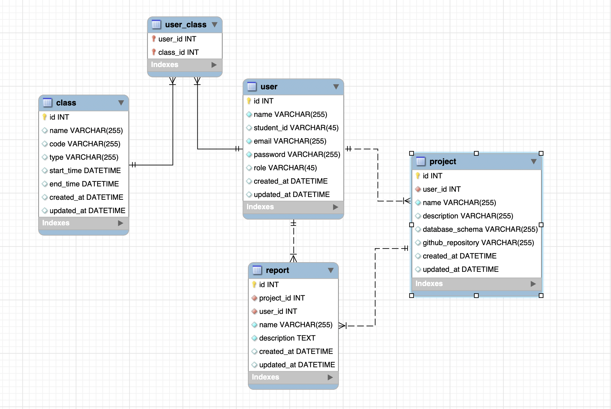

# Grad-pro-tracker-api

## Database schema



### Setup database with Prisma

1. Install the Prisma CLI as a development dependency in the project
   `npm install prisma --save-dev`
2. Set up Prisma with the init command of the Prisma CLI
   `npx prisma init --datasource-provider mysql`
3. Define Prisma schema

```js
model User {
  id        Int
  name      String
  ...
}
```

4. Run a migration to create your database tables with Prisma Migrate
   `npx prisma migrate dev --name init`
